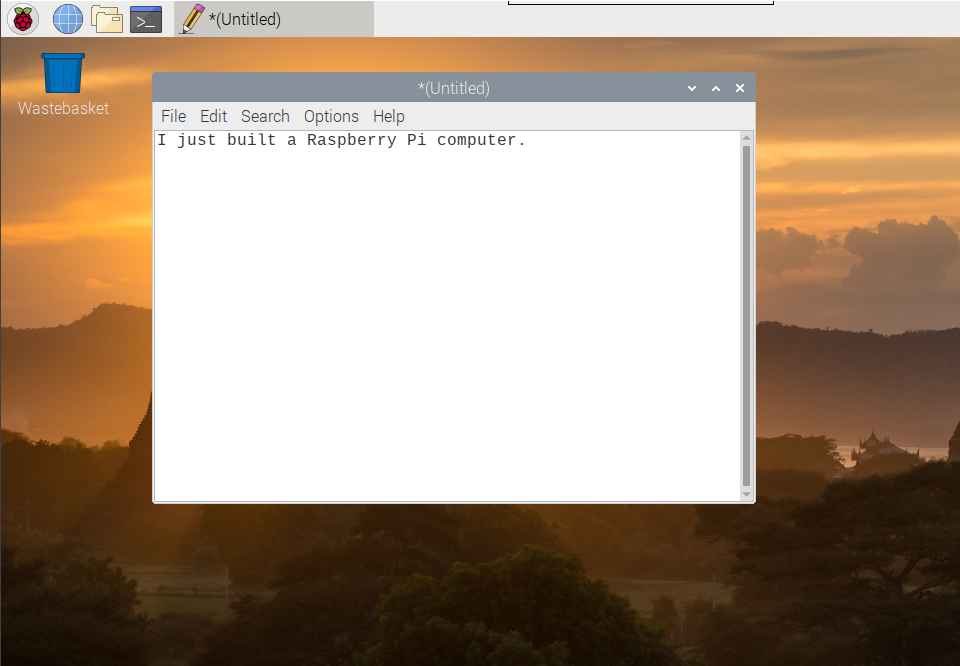
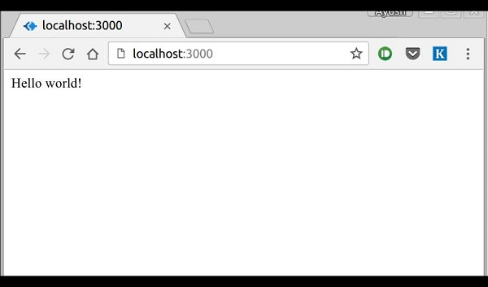
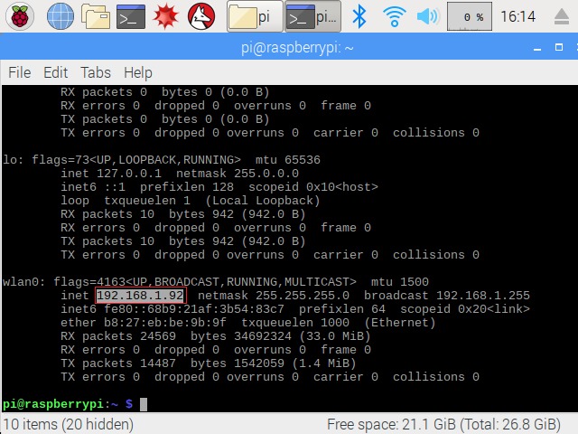

# Getting Started

## Setting up our Raspberry Pi

- Follow the setup instructions from the [Raspberry Pi tutorial](https://projects.raspberrypi.org/en/projects/raspberry-pi-getting-started)
- Make sure your Raspberry Pi is connected to the internet
- If everything went well, your screen will now look something like this:



Now we'll set up a Node server. If you know what you are doing, skip to the next section, otherwise here are some step-by-step instructions:

- Open terminal
- Create a folder for our project (`mkdir -p ~/projects/helloworld`)
- Change your directory to it (`cd ~/projects/helloworld`)
- Initialize a new npm project (`npm init`). If npm is not installed, you can do so following the instructions from [here](https://www.instructables.com/id/Install-Nodejs-and-Npm-on-Raspberry-Pi/)
- Don't worry about the npm init questions, the default values are fine

## Setting up our server

- Install [express](https://expressjs.com/) (`npm i express`)
- Create an index.js file (`gedit index.js`) and add the boilerplate from the [express hello world tutorial](https://expressjs.com/en/starter/hello-world.html):

```js
const express = require("express");
const app = express();
const port = 3000;

app.get("/", (req, res) => res.send("Hello World!"));

app.listen(port, () => console.log(`Example app listening on port ${port}!`));
```

- Let's run our server! (`node index.js`)
- Open the web browser and go to `localhost:3000`. It should look like this:



We have our server running!

- On a new terminal window (so that we don't close our server), run `ifconfig`. That will print a bunch of numbers, look for the machine ip (inet):



We can use this number from another device to access our server, for instance, in the example above we would visit `192.168.1.92:3000` from another computer or phone (they must be connected to the same network). Note that 3000 is the name of the port we set up.

Keep in mind that IP addresses are usually dynamically assigned. That means that when the computer reboots, we may get a different IP address (so our server would no longer exist at that address). If you want to access the server from the same IP, one option is to assign a static IP. Another one is to set up DHCP reservations in your router. To keep things simple we'll set up a static IP:

## Assigning a static IP address

- Let's edit the dhcpcd.conf file (`sudo gedit /etc/dhcpcd.conf`)
- At the bottom of the file, depending on whether you want to set a static IP address for a wired connection or a wireless one `eth0 = wired`, `wlan0 = wireless`:

```sh
interface eth0

static ip_address=192.168.1.92/24
```

Make sure to leave the `/24` at the end. Usually in a home network, the last number (`92` in our example) is the only one that changes per device. It can be any number greater than `1` and less than `255`. You probably want to set it to a fairly high number to make sure it doesn't crash with the dynamically assigned IPs (they'll usually start at `2` and go up one per device connected to the network).

Once changes are saved, reboot the Raspberry Pi and run `ifconfig` again. We should now have the same IP (or whichever one you set on the dhcpcd.conf file). Now, any time our server runs, we'll be able to find at the same exact address (`192.168.1.92:3000`)!

## DNS

When we visit a website, like www.google.com, our computer doesn't know how to connect to it. So, it first makes a request to a DNS server which will translate the address into an IP address. If you want to learn more about how DNS work, [this comicbook](https://howdns.works/ep1/) has a fun intro to it.

Wouldn't it be nice if we had a similar setup for our local network? `avahi-daemon` makes this setup easier. On a terminal, run:

```sh
sudo apt-get update
sudo apt-get upgrade -y
sudo apt-get install avahi-daemon
```

And that's it, now we'll be able to access the raspberry pi by its hostname (by default it's `raspberrypi`). With our server running, we can now navigate to `raspberrypi.local:3000`. Much nicer than remembering IP addresses!

You can change the hostname following [these instructions](https://www.cyberciti.biz/faq/ubuntu-change-hostname-command/), but keep in mind [you may need to do some additional debugging](https://superuser.com/a/1194792/416820) to get things to work.

If you still can't access the site, check out [this tutorial](https://www.howtogeek.com/167190/how-and-why-to-assign-the-.local-domain-to-your-raspberry-pi/) for additional tips.
