# Creating IFTTT Triggers

- Create an account at https://ifttt.com
- Enable the maker webhook (`https://ifttt.com/maker_webhooks`). This will help us call "triggers" from our node server
- Create an applet (`https://ifttt.com/create`) that will trigger an action, for instance:

|              |              |              |              |              |              |              |              |              |
| ------------ | ------------ | ------------ | ------------ | ------------ | ------------ | ------------ | ------------ | ------------ |
| 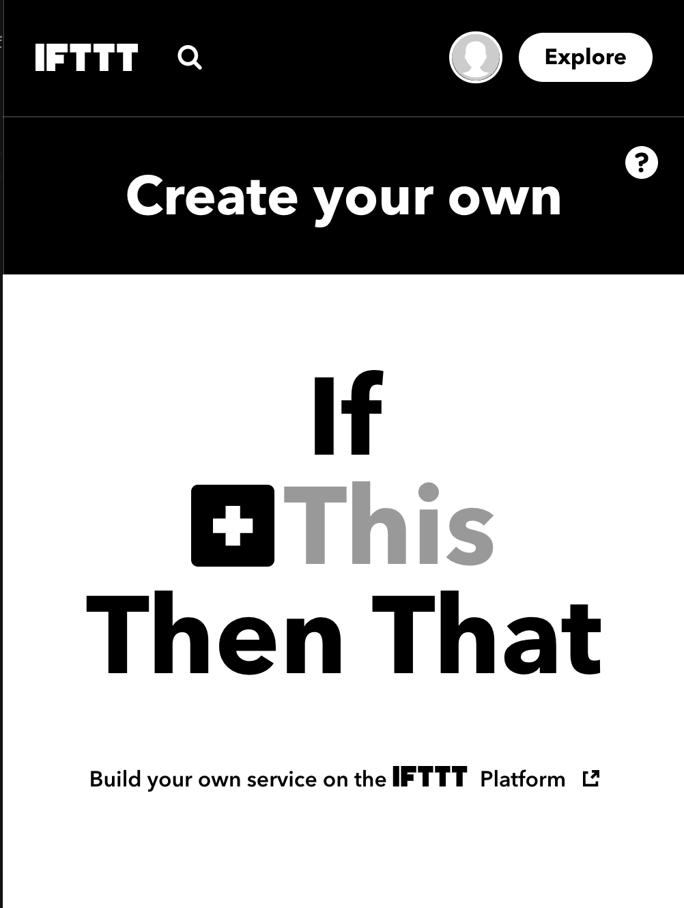 | 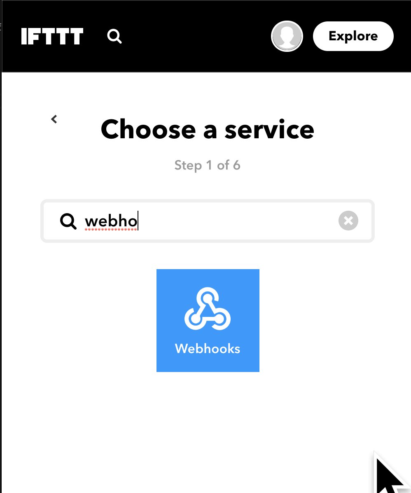 | 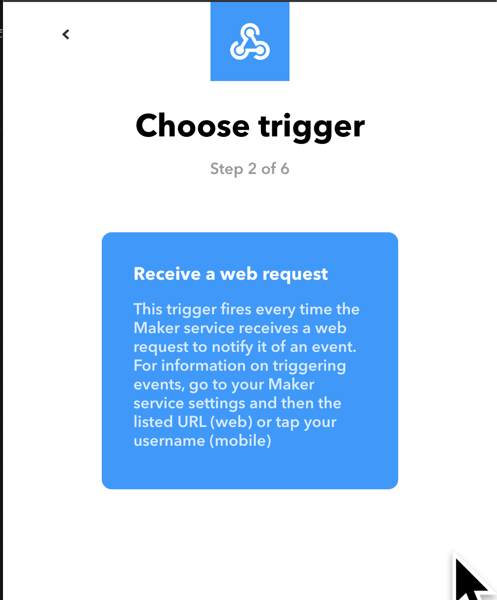 | 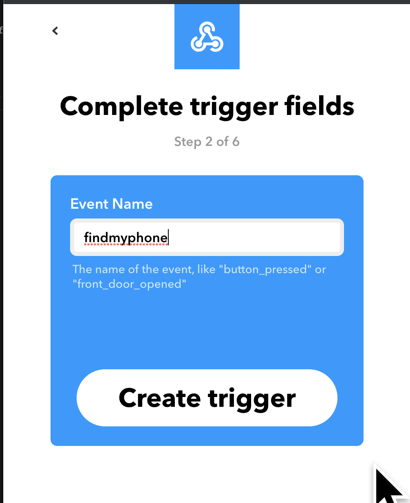 | 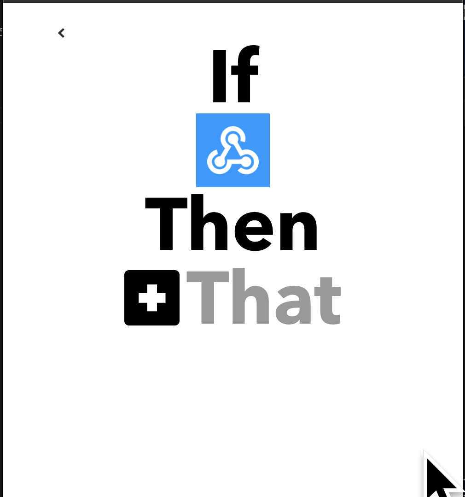 | 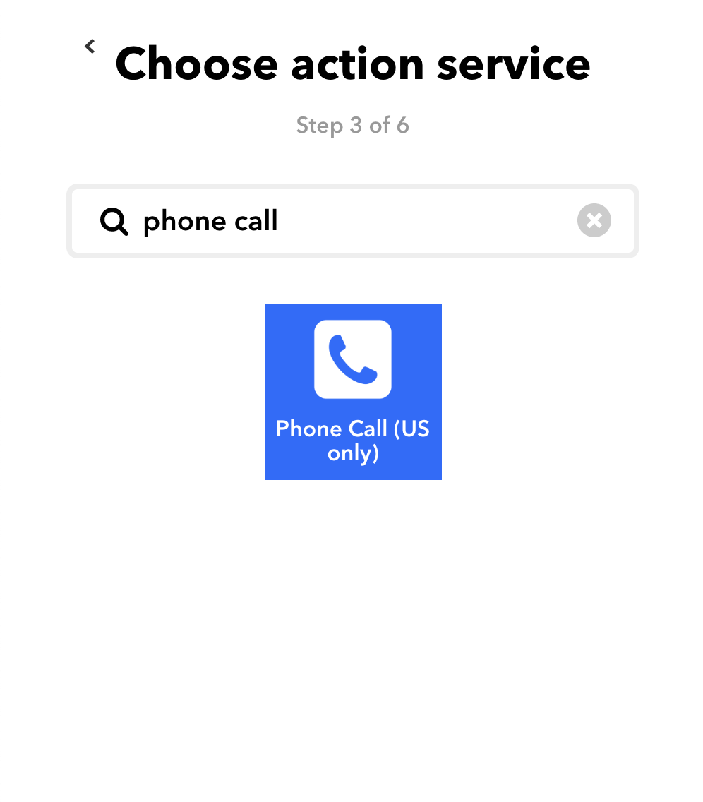 | 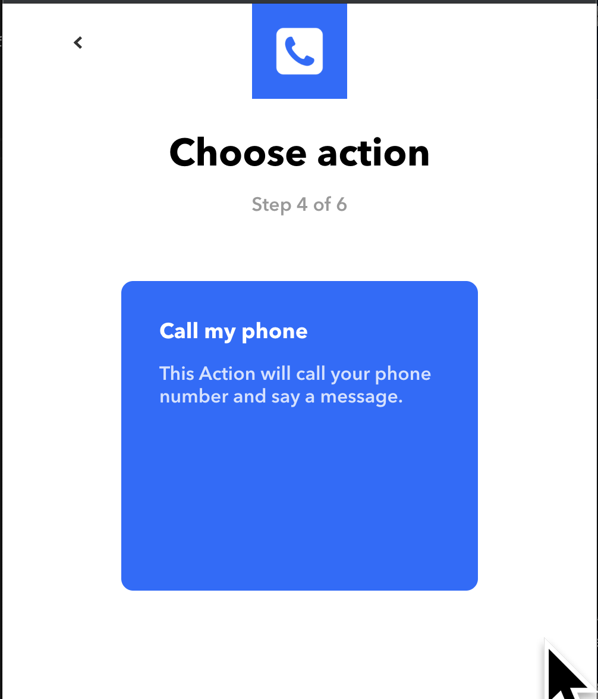 | 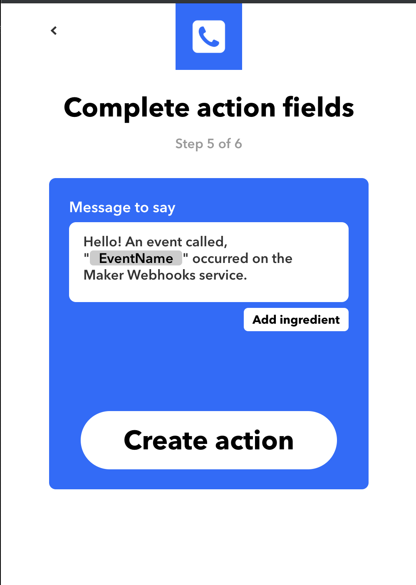 | 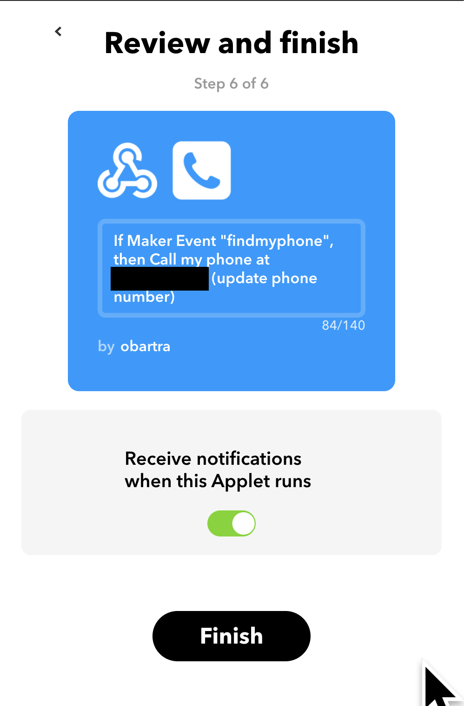 |

- Once the applet is created, go back to the maker webook page and click on the documentation button:

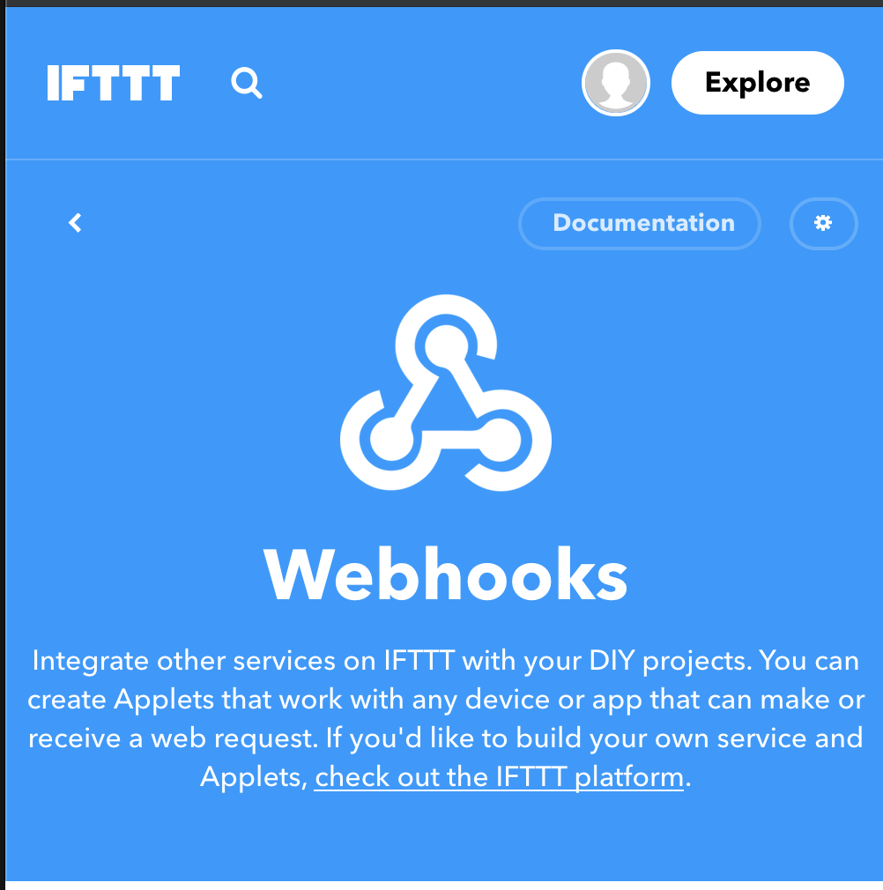

It should now show a screen that looks like this:

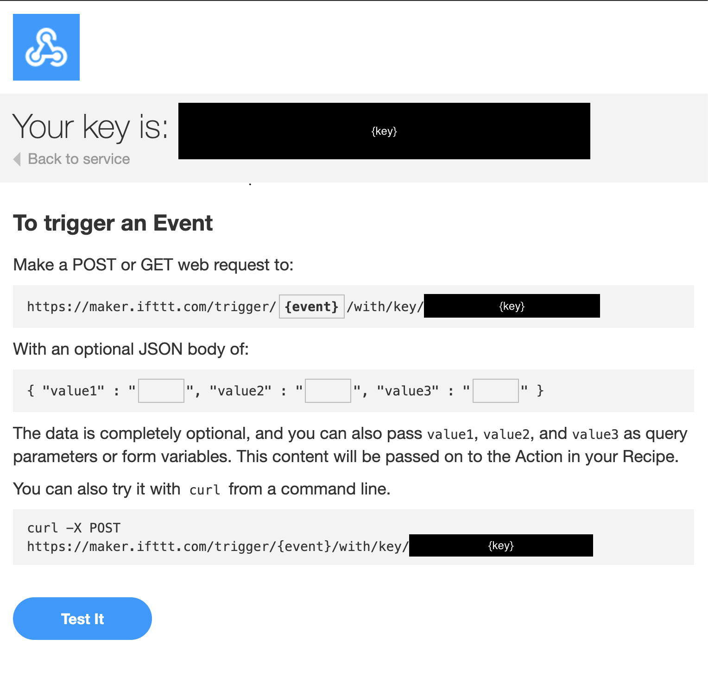

Let's make sure it works by triggering the event with the same name we've created (in our example it's `findmyphone`).

If everything went well, triggering should result in a call from ITTT!

Notice the CURL command at the bottom of the page, it should read something like:

```sh
curl -X POST https://maker.ifttt.com/trigger/{event}/with/key/{key}
```

This is the API call we need to make from our node server to trigger this event, let's make it happen. Let's create another project by copying the `helloworld` exercise. Our `index.js` should look like this:

```js
const express = require("express");
const app = express();
const port = 3000;

app.get("/", (_, res) => res.send("Hello World!"));

app.listen(port, () => console.log(`Example app listening on port ${port}!`));
```

We'll add the [request](https://www.npmjs.com/package/request) package to handle making the API request to IFTTT. Our code should now look something like:

```js
const express = require("express");
const request = require("request");

const app = express();
const port = 3000;
const iftttId = "{key}";
const baseURL = "https://maker.ifttt.com/trigger";
const event = "findmyphone"; // set to whichever event name you used

// Wrapper for `request` to promisify a post request
function post(url) {
  return new Promise((resolve, reject) => {
    request.post(url, function(error, response, body) {
      if (!error && response.statusCode == 200) {
        resolve(body);
      } else {
        reject(error);
      }
    });
  });
}

app.get("/", (_, res) => res.send("Hello World!"));

// `/findmyphone` route, that calls the IFTTT trigger
app.get("/findmyphone", (_, response) => {
  post(`${baseURL}/${event}/with/key/${iftttId}`)
    .then(body => {
      response.send(body);
      response.end();
    })
    .catch(e => {
      console.error(e);
      response.end();
    });
});

app.listen(port, () => console.log(`Example app listening on port ${port}!`));
```

Let's re run the server (`node index.js`). Now, if we visit `http://localhost:3000` we'll still see the previous "Hello World!" message but if we go to `http://localhost:3000/findmyphone`, IFTTT will call us again! The page should indicate the trigger succeeded:

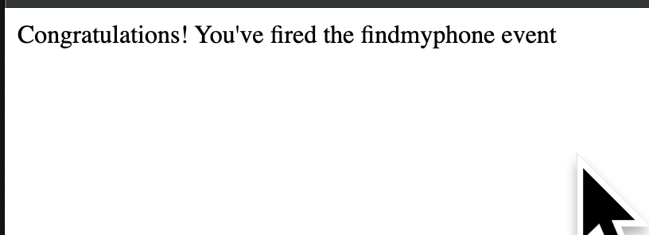

In case you ran into issues, tThings to watch out for are:

- Make sure your key is correct. Clicking the "edit" button on the documentation page for webhooks will update the key. Make sure the one you've set is the latest
- Make sure the event name is correctly spelled. IFTTT doesn't validate that the event name exists, it will simply ignore it if it doesn't match

Now that you know how to call triggers on IFTTT from our server, take a look at the different actions available and see if there are more actions you want to enable. You should be able to define new routes that call different actions or triggering multiple actions through a single route!
