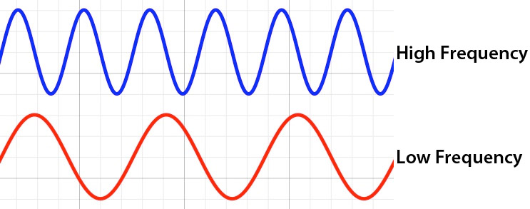
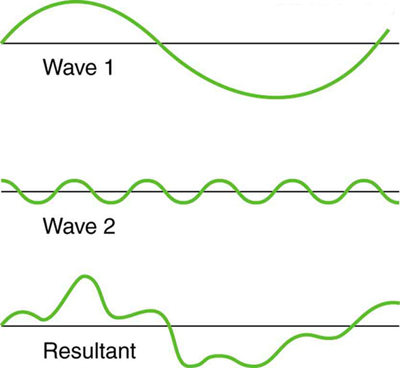

# 🔊 Sound Processing

## 🔔 Single Sound Waves

All sound can be represented as a wave.

The volume is represented by the amplitude: how tall the wave is indicates how "loud" the sound is.
The wavelength is the "width" of the wave, the distance between repeating points. A shorter wavelength indicates a higher pitch.

In the example above both waves have similar wavelengths but different amplitudes (the one on the left is louder). In the one below we see different frequencies but same amplitude:

These are examples in the time domain, they show the sound over time. We can look at it inthe frequency domain too. Instead of looking at how the sound varies over time, we can regiter the different frequencies and amplitudes (this frequency domain).

The frequency (how "often" the wave repeats) is expressed in Hertz. A wave that repeats every one second has a frequency of 1 Hertz (Hz), if it repeats 2 times a second it's 2Hz, 3 times it's 3Hz and so on. 1000Hz is represented as 1KHz (_one kilo-hertz_).

For instance, in the frequency domain, a single tone, can be represented as follows:

If you are curious what a single tone at 1KHz sounds like check [this video](https://www.youtube.com/watch?v=PyD9cMarVJk).

## 🌎 Real World Sounds

All the sound waves above have a single frequency. In reality, most sounds are the result of combining multiple sound waves at different amplitudes and frequencies that start and end at different points:

For instance, human voice has frequencies in the range of 80-300Hz. Recorded over a period of time, it produces a pattern that lookw like this:

As we've seen above, during any time interval, we can separate the sound into each of the individual sound waves; each one with its own amplitude and frequency.

Each wave is represented as a line on the frequency domain. The position of the line (left-right) indicates the frequency (low-high) and the altitude represents the volume (amplitude in the time domain).

Another way to think about it is as if the frequency domain was looking at the composing waves from the "side":

## 🎵 Music

Musical instruments, although they sounds close to one given frequency (a musical note), they produce many different sound waves per note.

That's what allows us to distinguish different musical instruments. This makes sense since even when they play the same note a guitar will sound different than a piano.

For instance, compare [a piano A4](https://www.youtube.com/watch?v=xF6qfxMHXVs) with a [tuning pitch](https://www.youtube.com/watch?v=0LxtrLizkrU). They are both at 440Hz but _sound_ very different. Different instruments will have different frequencies "main" frequencies when playing the same note:

If they are properly tuned, although they will sound different and have different frequencies, looking for a high amplitude in 440Hz will tell us if an A4 has been played on _any_ instrument.

If we want to know if a given instrument was used to play a given note, we'll look at the smaller frequencies as well. In that sense, we can treat the different, smaller frequencies as an instrument "fingerprint".

[Audacity](https://www.audacityteam.org/) has a frequency analyzer that may be useful to help you identify the frequencies that each note you play produces.

## 🧮 Math

Now that we understand how sound waves work and how different musical notes are produced, we need to figure out _how_ we know which frequencies are being used.

We know that once we have the right frequencies we'll know which notes are being played. The tricky part then is in converting a sound sample from the time domain (a recorded file) into the frequency domain.

The [Fourier transform](https://en.wikipedia.org/wiki/Fourier_transform) describes how to convert sound into the frequency domain. The [Fast Fourier Transform](https://en.wikipedia.org/wiki/Fast_Fourier_transform) is faster to compute and usually a good enough approximation.

The math for either of them gets hairy, fortunately as javascript developers, we can solve this problem like any other problem. With `npm install` of course.

Another algorithm that's useful to identify specific frequencies is [Goertzel](https://en.wikipedia.org/wiki/Goertzel_algorithm)'s, which can help us know when a given frequency is active, take a look at the [goertzel-filter](https://www.npmjs.com/package/goertzel-filter) npm package for more information.

## 📝 Example

We can use the [web-audio-api](https://github.com/audiojs/web-audio-api) in our app. This package implements the native [Web Audio API](https://developer.mozilla.org/en-US/docs/Web/API/Web_Audio_API) for node.

If you want to see an example of using it in the browser, MDN has a neat demo [here](https://mdn.github.io/voice-change-o-matic/)
