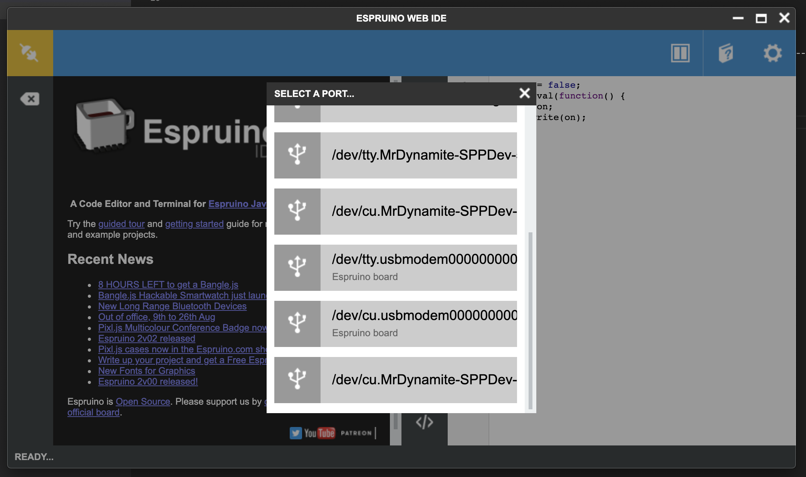
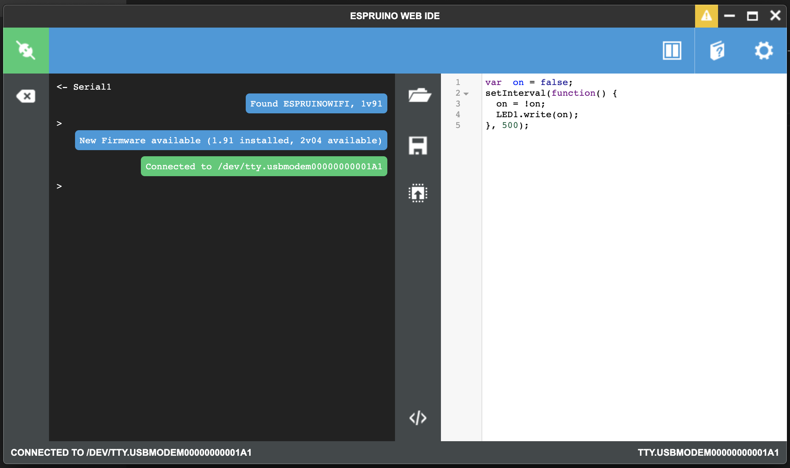
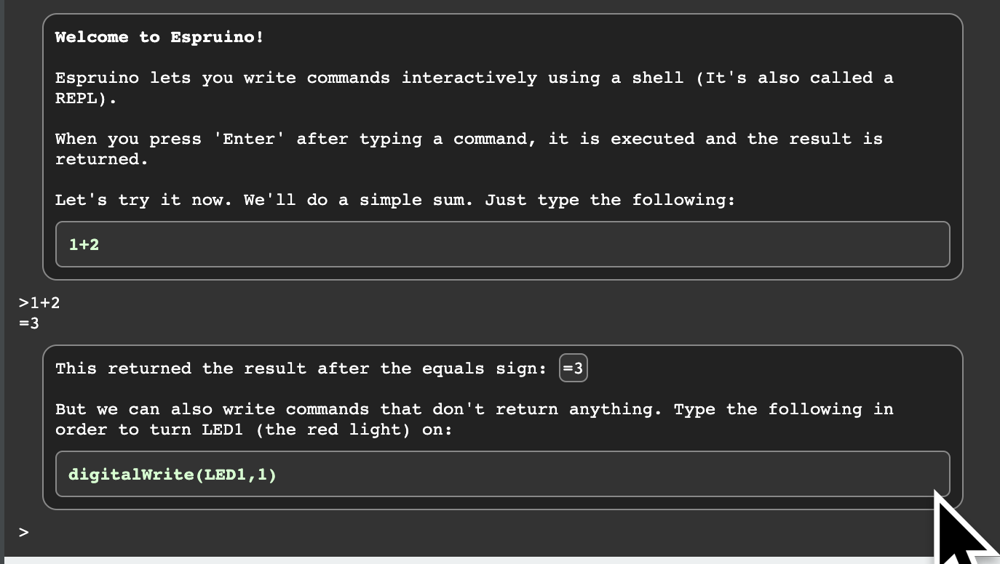
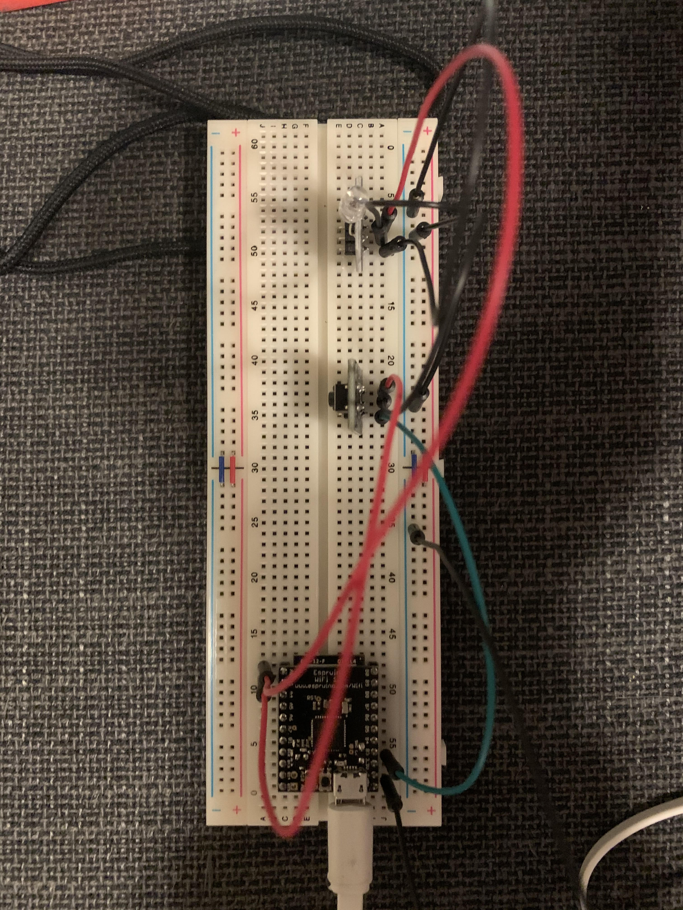

# Getting started with Espruino

Before diving in, let's take a look at Espruino's [Getting Started video](https://www.espruino.com/Quick+Start+USB). We'll follow the same setup:

- Install the [Chrome extension](https://chrome.google.com/webstore/detail/espruino-web-ide/bleoifhkdalbjfbobjackfdifdneehpo?hl=en). Espruino IDE will now appear on `chrome://apps/` as an app you can launch. You can also add it a desktop icon for it to make it easier to find.
- Connect the Espruino board to a USB port on your computer
- open the Espruino IDE and click "Connect". You may see multiple devices to connect to, select the one that says "Espruino board" as shown on the image below:



- the IDE should now look like this (notice the green icon on the top left corner):



It's important to update firmware. Unless you are at least on v.2.0 or the wifi connection example won't work. Make sure to follow the instructions in the popups to update the firmware. Once completed (and reconnected) we should be good to go!

The left hand side contains a terminal ([REPL](https://codewith.mu/en/tutorials/1.0/repl)) to the Espruino board where we can run commands directly. The right hand side contains the code we can write and then send to Espruino when ready. You may also want to follow the built-in tutorial



The three buttons in the middle of the IDE (from top to bottom) allow us to open a file, save it and upload the program to the Espruino board. To write content on the board so that it's run as soon as it's powered (without having to connect it to the computer) you can type `save()` in the REPL.

To connect to the wifi we need to instruct it to do so every time it starts. Following the [Connecting to an AP example](https://www.espruino.com/WiFi#connecting-to-an-ap)), we can do something like:

```
const wifi = require("Wifi");
const http = require("http");

const WIFI_NAME = "[YOUR WIFI NAME]";
const WIFI_OPTIONS = {
  password : "[YOUR WIFI PASSWORD]"
};
const URL = 'http://www.pur3.co.uk/hello.txt';

wifi.connect(WIFI_NAME, WIFI_OPTIONS, (err) => {
  if (err) {
    console.log("Connection error:", err);
    return;
  }
  console.log("Connected!");
  getPage();
});

function getPage() {
  http.get(URL, (res) => {
    console.log("Response:", res);
    res.on('data', (d) => console.log("--->", d));
  });
}
```

Note that we didn't install the `Wifi` module. This is because some packages are automatically fetched for us. You can read more about how modules work for Espruino [here](https://www.espruino.com/Modules). In particular, take a look at how to [load modules from a folder](https://www.espruino.com/Modules#from-a-local-folder). This will allow us to define a folder where we can have all our Espruino projects and be able to load modules that we work on locally on our favorite code editor.

In the example above, we make requests to a URL. We could instead make a request to any of our local express servers that we built in previous projects instead. We could also turn Espruino into one (e.g using the [WebServer](https://www.espruino.com/WebServer) package). So with it, we can both send and receive messages between the Raspberry Pi and the Espruino board. That approach gets fairly verbose, particularly as we need to add and remove endpoints for different actions and as we want to coordinate actions between multiple Espruino boards. Instead we'll use a PubSub model.

If you are not familiar with Pub/Sub there is a quick intro [here](https://blog.stackpath.com/pub-sub/). With it, we are able to send and receive messages across a shared channel between multiple devices. Anyone can "listen" for a message and anyone can send new messages.

To make this work, we'll use our Raspberry Pi as our Pub/Sub broker (the one that sets up that communication channel) and the Raspberry Pi and any Espruino boards will be able to connect to it and send and receive messages from there.

We'll follow [these instructions](https://www.instructables.com/id/Installing-MQTT-BrokerMosquitto-on-Raspberry-Pi/) on how to set up Mosquito (the PubSub manager) in the Raspberry Pi:

```sh
sudo apt-get install mosquitto mosquitto-clients
```

Note that we install both, the broker (mosquitto) and the client. This allows the Raspberry Pi to connect to it and send and receive messages. Otherwise it would only set up the channel and communication would only happen between the different devices that connect to it.

## Detecting input

Because the Espruino is such a small device, we'll relegate most of the computation to the Raspberry Pi. Instead we'll use the Espruino boards to either detect when something happened (e.g. a button was pushed, temperature changed) or take action (start a servo, turn on a light).

The initial example works with the Espruino built-in button and lead. Try it out, click "Send to Espruino" without changing the code. If you press the little button on the board, the green LED will light up.

Let's start playing with external hardware, TODO:::



```js
let active = false;

setWatch(
  function() {
    digitalPulse(LED2, 1, 50);
    active = !active;
    analogWrite(A0, active ? 1 : 0);
  },
  A1,
  { repeat: true, debounce: 50, edge: "rising" }
);
```


