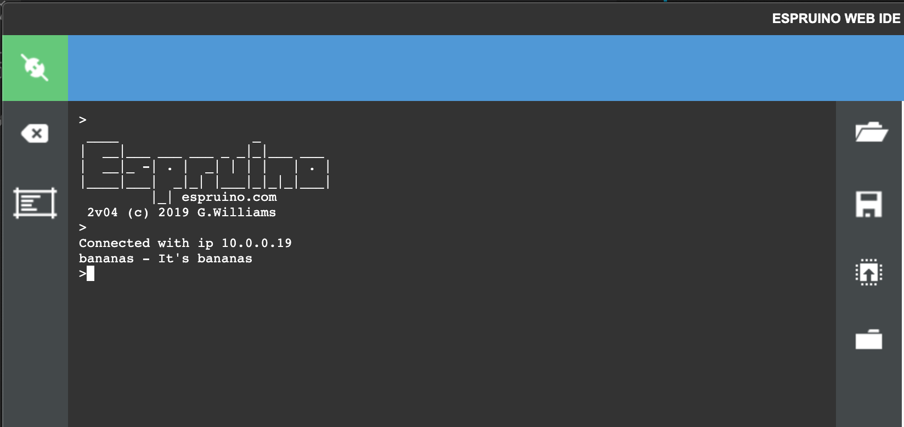

# Getting started with Espruino

Before diving in, let's take a look at Espruino's [Getting Started video](https://www.espruino.com/Quick+Start+USB). We'll follow the same setup:

- Install the [Chrome extension](https://chrome.google.com/webstore/detail/espruino-web-ide/bleoifhkdalbjfbobjackfdifdneehpo?hl=en). Espruino IDE will now appear on `chrome://apps/` as an app you can launch. You can also add it a desktop icon for it to make it easier to find.
- Connect the Espruino board to a USB port on your computer
- open the Espruino IDE and click "Connect". You may see multiple devices to connect to, select the one that says "Espruino board" as shown on the image below:


- the IDE should now look like this (notice the green icon on the top left corner):


It's important to update firmware. Unless you are at least on v.2.0 or the wifi connection example won't work. Make sure to follow the instructions in the popups to perdorm the update. Once completed (and reconnected) we should be good to go!

The IDE has, on the left hand side, a terminal ([REPL](https://codewith.mu/en/tutorials/1.0/repl)) to the Espruino board where we can run commands directly. The right hand side contains the code we can write and then send to Espruino when ready. You may also want to follow the built-in tutorial:


The three buttons in the middle of the IDE (from top to bottom) allow us to open a file, save it and upload the program to the Espruino board. To write content on the board so that it's run as soon as it's powered (without having to connect it to the computer) you can type `save()` in the REPL.

## Detecting input

Because the Espruino is such a small device, we'll relegate most of the computation to the Raspberry Pi or other devices. The Espruino boards are great to either detect when something happened (e.g. a button was pushed, temperature changed) or take action (start a servo, turn on a light).

The initial example works with the Espruino built-in button and LED. Try it out, click "Send to Espruino" without changing the code. If you press the little button on the board, the green LED will light up.

That's neat! But let's start playing with external hardware, we'll implement the same example but this time using external components. The Button and the 7 Color Flashing modules are convenient because they already bundle a couple components but you should be able to implement similar behavior with any LED, a couple resistors and a button.

Following the specifications of each module, we'll connect the ground wire to the GND pin on the board. For the button we'll want one end to the 3.3v output and the other one on A1. The LED will be connecteed to A0:


The following code will watch for changes on A1 (when we close the connection from the 3.3v it will receive that output and detect the change), it will then call the function to trigger the pulse

```js
let active = false;

setWatch(
  () => {
    // Activate the internal LED for 2 seconds so we know the button was pressed
    digitalPulse(LED2, true, 1000);
    // Toggle active state
    active = !active;
    // With this button press, if the button was active turn off the LED, if it
    // was inactive, now turn it on
    A0.write(active ? 1 : 0);
  },
  A1,
  { repeat: true, debounce: 50, edge: "rising" }
);
```

💥 We've just built our first circuit!


## Wifi

The Espruino Wifi board has a wifi module built in. Let's take advantage of it. To make it connect we'll need to instruct it to do so every time it starts (whenever it is powered). Following the [Connecting to an AP example](https://www.espruino.com/WiFi#connecting-to-an-ap)), we can do something like:

```js
const wifi = require("Wifi");
const http = require("http");

const WIFI_NAME = "[YOUR WIFI NAME]";
const WIFI_OPTIONS = {
  password: "[YOUR WIFI PASSWORD]"
};
const URL = "http://www.pur3.co.uk/hello.txt";

digitalPulse(LED1, 1, 150);

wifi.on("disconnected", () => LED2.write(1));

wifi.connect(WIFI_NAME, WIFI_OPTIONS, err => {
  if (err) {
    LED2.write(1);
    console.log("Connection error:", err);
    return;
  }
  digitalPulse(LED1, 1, 50);
  console.log("Connected!");

  fetchPage(URL, (err2, data) => {
    if (err2) {
      LED2.write(1);
      console.log("Fetching error:", err);
    } else {
      console.log(data);
    }
  });
});

function fetchPage(url, callback) {
  http.get(url, res => {
    let data = "";

    res.on("data", d => {
      data += d;
    });
    res.on("error", callback);
    res.on("end", () => callback(null, data));
  });
}
```

The URL is just a page that returns 'Hello World' (you can check it by visiting `http://www.pur3.co.uk/hello.txt` on your browser). It will help us make sure we are connected to the internet.

Note that we didn't install the `Wifi` module. This is because some packages are automatically fetched for us. You can read more about how modules work for Espruino [here](https://www.espruino.com/Modules). In particular, take a look at how to [load modules from a folder](https://www.espruino.com/Modules#from-a-local-folder). This will allow us to define a folder where we can have all our Espruino projects and be able to load modules that we work on locally on our favorite code editor.

## Pub / Sub

In the example above, we made requests to a URL. We could instead make a request to any of our local express servers that we've built (using the IP address of the server). We could even turn Espruino into one (e.g using the [WebServer](https://www.espruino.com/WebServer) package).

So with it, we can both send and receive messages between the Raspberry Pi and the Espruino board. That approach gets fairly verbose, particularly as we need to add and remove endpoints for different actions and as we want to coordinate actions between multiple Espruino boards. Instead we'll use a PubSub model.

If you are not familiar with Pub/Sub there is a quick intro [here](https://blog.stackpath.com/pub-sub/). The TL;DR is it allows us to send and receive messages across a shared channel between multiple devices. Anyone can "listen" for a message and anyone can send new messages.

To make this work, we'll use our Raspberry Pi as our Pub/Sub broker (the one that sets up that communication channel) and the Raspberry Pi and any Espruino boards will be able to connect to it and send and receive messages from there.

We'll follow [these instructions](https://www.instructables.com/id/Installing-MQTT-BrokerMosquitto-on-Raspberry-Pi/) on how to set up Mosquito (the PubSub manager) in the Raspberry Pi:

```sh
sudo apt-get install mosquitto mosquitto-clients
```

We install both, the broker (mosquitto) and the client. This allows the Raspberry Pi to connect to it and send and receive messages. Otherwise it would only set up the channel and communication would only happen between the different devices that connect to it.

Let's test it out, let's open 2 terminals in the raspberry Pi. On one, run:

```sh
mosquitto_sub -t bananas
```

`bananas` is the name of the channel. We can name it anything you want, probably use something that makes more sense but any name is good. Also messages sent to the Espruino board are limited to 127 characters including the name of the channel so don't make it too long!

On the other terminal we'll now send ourselves a message:

```sh
mosquitto_pub -t bananas -m "It's bananas!"
```

If you look on the first terminal you'll see the message has been sent. Nothing too exciting so far. Let's use mosquitto connect between machines.

```js
const mqtt = require("tinyMQTT").create("[YOUR RASPBERRY PI IP ADDRESS]");
const wifi = require("Wifi");

const WIFI_NAME = "[YOUR WIFI NAME]";
const WIFI_OPTIONS = {
  password: "[YOUR WIFI PASSWORD]"
};

mqtt.on("connected", () => {
  LED1.write(0);
  mqtt.subscribe("bananas");
});

mqtt.on("message", msg => {
  digitalPulse(LED2, true, 2000);
  console.log(msg.topic, "-", msg.message);
});

mqtt.on("disconnected", () => {
  LED1.write(1);
  mqtt.connect();
});

wifi.connect(WIFI_NAME, WIFI_OPTIONS, err => {
  if (err) {
    LED1.write(1);
    console.error("Connection failed", err);
    return;
  }
  wifi.getIP((err2, data) => console.log("Connected with ip", data.ip));
  mqtt.connect();
});
```

If everything went well, we'll see something like this on the output:



As you see, by connecting to the broker all we need to do is send the message and anyone who subscribes to it receives it. Although this code outputs the IP address of the Espruino board, it's not needed. Only the IP address of the broker matters. As far as all clients are connected to it, they can all talk to each other.

## Extra Credit

Take a look at the [mqtt.js](https://www.npmjs.com/package/mqtt) package. Can you figure out how to make our express server or one of our node scripts send a message through mosquito?

What about the opposite, how do we send messages to our channel based on actions a user takes on the Espruino board?

We'll explore both of this ideas in our next project.
