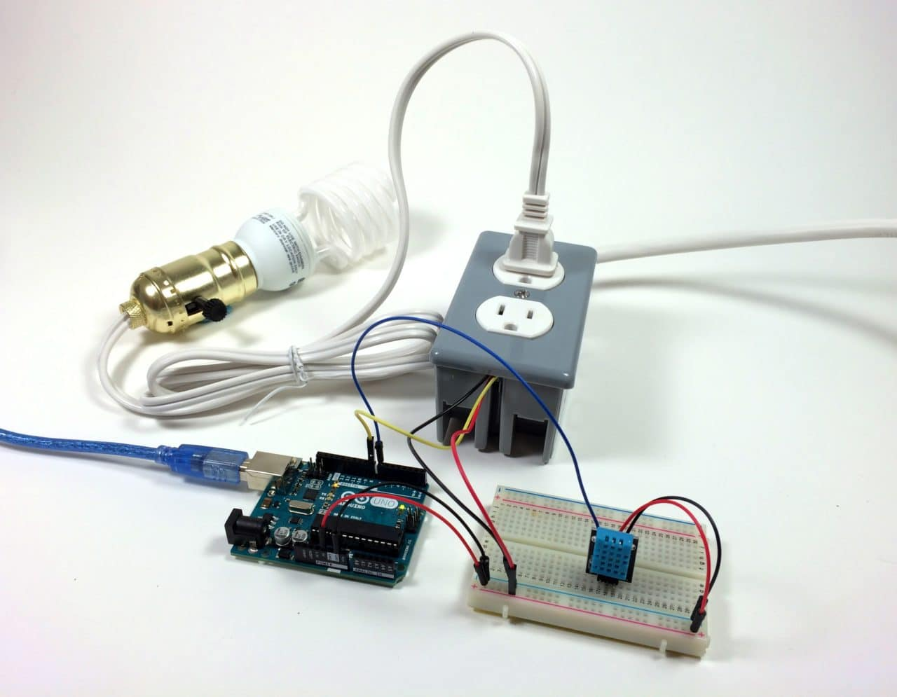
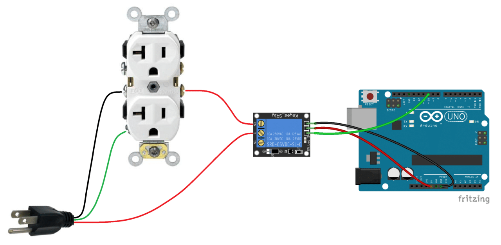
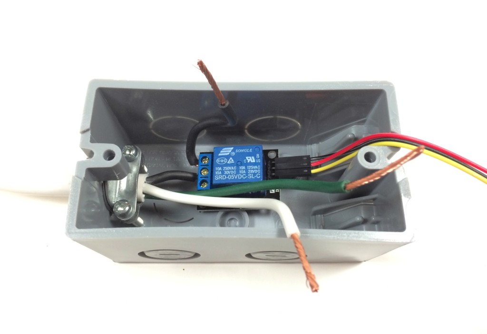

# Setup Description

Using a wake word from the Raspberry Pi server we'll start a pump connected to our Espruino Wifi. We'll also want to bake in a way to track when was the last time we activated it to avoid watering the plants too much.

## Setting up the Database

We'll use MongoDB to store logs so that when the server crashes or restarts we don't loose previous information.

By default Mongo uses the `/data/db` path to store the contents of the database. We have several options here.

We can either:

- create the directory and give sudo permissions for read and write: `sudo mkdir -p /data/db && sudo chmod -R go+w /data/db`
- create the directory and assign current user as the owner: `sudo mkdir -p /data/db && sudo chown -R $USER /data/db`
- change the directory where we'll store the db (when starting `mongo` we'll instead call it with a custom path, e.g.: `mongo --dbpath=./src/db/data`)

On a Mac we can install MongoDB with:

```sh
brew services stop mongodb
brew uninstall mongodb

brew tap mongodb/brew
brew install mongodb-community
brew services start mongodb-community
```

On the Raspberry Pi we can install it with:

```sh
sudo apt-get update && sudo apt-get install  -y mongodb
```

Let's check the connection to make sure things are running as expected:

```sh
mongo --eval 'db.runCommand({ connectionStatus: 1 })'
```

If there are any errors you can try with `mongod --repair`, that will give you more information if there are any errors.

Once fixed, on Ubuntu you can restart the deamon with: `sudo service mongod start`

## Setting up the server

To make it easier to start Mongo, the `water/package.json` has a `db` script that calls it making sure a local folder is used but it still requires mongo to be installed globally.

The next step is to set up the actual server. Here we won't use anything new but we'll instead be integrating everything we've learned in the past projects:

- Express server
- MQTT Pub / Sub connection
- Permanent / DB storage
- Voice recognition

You can implement this any way you want but there's a sample server on the `water/server` folder. This is what it does:

- The `db` folder exports a method to add a log (`insertLog`) and one to retrieve the last 100 (`readLogs`).
- The `express` folder creates an endpoint `/logs` at port 3001 that returns the results of the previous `readLogs`.
- The `detector` folder starts the microphone and listens for the `jarvis` keyword. If `jarvis` is set it then listens for the word `water`. This helps prevent accidental activations any time the word water is used unrelated to this command. It also enables sentences like "Hey Jarvis, water the plants".
- The `mqtt` folder connects to the espruino board and publishes the event to trigger the water pump
- The top level file (`index.js`), tracks and logs all events and connects the `water` command from the detector to the `mqtt` trigger.
- The `events.js` file manages events so all other sections can fire events and the top level `index.js` logs them when they occur:

[](./server.png)

If you now add a `server` script on `package.json`, we would first call `npm run db` in one terminal and `npm run server` in another. If you want to run these scripts on boot, check out the [autostart](../autostart) project.

## Setting up the client

Install or update the [create react app](https://github.com/facebook/create-react-app) package with: `npm i -g create-react-app`. We can now create a new client: `create-react-app client`. This will create a `client` folder that will contain the website we'll be able to call from any device connected to the same wifi network.

Here we can go as crazy as we want. The included app just shows the results of the `/logs` query but you can add more API calls and modify the frontend accordingly. The only thing to keep in mind is that we'll want to set up the [proxy prop](https://create-react-app.dev/docs/proxying-api-requests-in-development/) in the `package.json` to match the URL of the express server. In our example client (`water/client/package.json`) you can see `"proxy": "http://localhost:3001"` so that all endpoints exposed by it will be available directly on the react app. For instance, the `/logs` endpoint also becomes available under `/logs`. Because of this, and to avoid conflicts with potential routes, you may want to prefix all API routes with `/api`.

If you have an old phone or tablet, you can [disable autolock](https://itstillworks.com/stop-iphone-sleeping-25832.html) and have it always connected to a power source and showing that page. That will make for a quick dashboard.

## Setting up the water pump

The espruino board we have can only output 5V but the water pump we have is connected to a power outlet (120v). How can we provide enough power to the water pump without frying our board?

Here is where power [relays](https://www.espruino.com/Relays) come in. It's important we are careful when working with power outlets because of the high voltage. It's not only that we can fry your Espruino but that we can injure ourselves as well. We'll follow these rules:

- Never work on the device when it's connected
- All cables carrying more than 5v will be covered and secured in an enclousre when connected

As [the guide we'll follow](http://www.circuitbasics.com/build-an-arduino-controlled-power-outlet/) states:

> WARNING!! – THIS PROJECT INVOLVES WORKING WITH HIGH VOLTAGES THAT CAN CAUSE SERIOUS INJURY, DEATH, AND/OR SET YOUR HOUSE ON FIRE. PLEASE PROCEED WITH CAUTION, AND ALWAYS MAKE SURE CIRCUITS ARE UN-PLUGGED BEFORE WORKING ON THEM.

That guide uses an Arduino One to connect to a lightbulb. We will use the Espruino Wifi and a water pump instead but the instructions for building the relay are the same (and more detailed there).

Notice how the only exposed cables are the (5v) ones that connect to the Espruino to turn the device on and off:



This schematic provides a more clear layout of where the cables will be connected:



For the power cord we can use any power cord / power strip and cut the the cable:


We'll then use the voltage tester to identify the hot wire and ground and mark them. Follow the guide for images and step by step instructions but we'll want the following:

- Connect relay cables for 5v, ground and signal
- Hot wire (black in image) to the common (C) terminal of the relay
- Connect a 4 inch piece of the hot wire and strip off about 1/4 inch of the insulation. Insert it into the NO terminal of the relay



## Setting up the Espruino

The Espruino setup will need to connect to the Wifi and same channel than the MQTT server for the Raspberry Pi was setting up, much like we did for the push-a-button project.

To make sure the set up is working, let's first turn on the internal LED1 light when the MQTT call is triggered:

```js
const mqtt = require("tinyMQTT").create("[YOUR RASPBERRY PI IP ADDRESS]");
const wifi = require("Wifi");

const WIFI_NAME = "[YOUR WIFI NAME]";
const WIFI_OPTIONS = {
  password: "[YOUR WIFI PASSWORD]"
};

mqtt.on("connected", () => {
  LED1.write(0);
  mqtt.subscribe("actions");
});

mqtt.on("message", msg => {
  if (msg === "water") {
    digitalPulse(LED2, true, 2000); // We'll change this for the signal we'll emit to turn on the water pump
  }
});

mqtt.on("disconnected", () => {
  LED1.write(1);
  mqtt.connect();
});

wifi.connect(WIFI_NAME, WIFI_OPTIONS, err => {
  if (err) {
    LED1.write(1);
    console.error("Connection failed", err);
  } else {
    mqtt.connect();
  }
});
```

Once it's wired and the LED turns on when we trigger the water command, we can change the code to turn on the water pump instead. Much like we did we the external LED on the push a button project, we can now trigger the water pump using the IO pin that the switch signal is connected to.

## Extra credit

We've seen how to make an HTTP request from our react app to our express server but what if we want to be notified when status change? Maybe we want to know if we lost connection with MQTT, if there's been an error writting to the database or be notified when we start and stop watering the plants.

We could make periodic requests to the backend or implement [long polling](https://www.pubnub.com/blog/http-long-polling/) but HTTP is not really meant for that and these solutions aren't verey efficient. When we want the backend and the frontend to communicate back and forth whenever there are updates, [WebSockets](https://developer.mozilla.org/en-US/docs/Web/API/WebSockets_API) are a better choice. Using the [ws](https://www.npmjs.com/package/ws) package, are you able to set up web sockets to provide updatess to the frontend?

On the frontend, are you able to leverage the [MDN samples](https://developer.mozilla.org/en-US/docs/Web/API/WebSockets_API/Writing_WebSocket_client_applications) to receive status updates and incorporate them in the React app?
